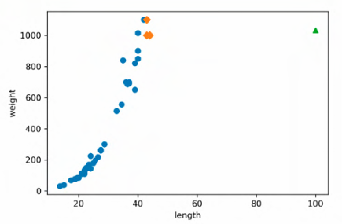
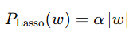
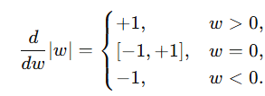
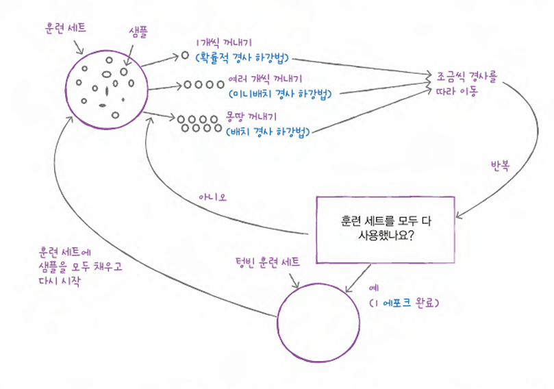

# 회귀 알고리즘과 모델 규제
## 1. k-최근접 이웃 회귀
```
❓ 회귀
두 변수 사이의 상관관계를 분석하는 방법
```
### 회귀 vs 분류 모델
| 항목                 | 회귀 모델 (Regression)                                                                                                                          | 분류 모델 (Classification)                                                                                                                                               |
| ------------------ | ------------------------------------------------------------------------------------------------------------------------------------------- | -------------------------------------------------------------------------------------------------------------------------------------------------------------------- |
| **목표 변수**          | 연속형(Continuous) 값<br>예: 가격, 온도, 수익률 등                                                                                                       | 이산형(Discrete) 범주(Label)<br>예: 스팸/정상, 질병 유무, 이미지 클래스 등                                                                                                                |
| **예측 결과**          | 실수(Real number)<br>$\hat y \in \mathbb{R}$                                                                                                  | 범주 레이블 또는 확률<br>$\hat y \in \{0,1,\dots\}$ 또는 $P(y=k)$                                                                                                               |
| **손실 함수(Loss)**    | MSE, MAE, Huber 등<br>$\displaystyle \frac1n\sum(y_i - \hat y_i)^2$                                                                          | Cross-entropy, Hinge 등<br>$-\sum y_i\log \hat p_i$ 등                                                                                                                 |
| **평가 지표(Metrics)** | MSE, RMSE, MAE, $R^2$ 결정계수 등                                                                                                                | Accuracy, Precision, Recall, F1-score, AUC 등                                                                                                                         |
| **대표 알고리즘**        | - 선형 회귀(Linear Regression)<br>- 의사결정나무 회귀(Decision Tree Regressor)<br>- KNN 회귀(KNeighborsRegressor)<br>- 랜덤포레스트 회귀(RandomForestRegressor) 등 | - 로지스틱 회귀(Logistic Regression)<br>- 의사결정나무 분류(Decision Tree Classifier)<br>- KNN 분류(KNeighborsClassifier)<br>- 랜덤포레스트 분류(RandomForestClassifier), SVM, Naive Bayes 등 |
| **활용 예시**          | - 주택 가격 예측<br>- 주식 수익률 예측<br>- 온도·습도 예측                                                                                                     | - 이메일 스팸 분류<br>- 암 진단(양성/음성)<br>- 이미지 속 객체 분류                                                                                                                        |

### 과소적합
- train, test 성능이 모두 낮을 때도 과소적합이지만, **train < test 인 경우**에도 해당됨

### 문제점

- 훈련 데이터를 벗어나는 데이터에 대해서는 좋지 않은 성능 

💡새로운 데이터셋(예측하고자 하는 데이터가 범위 내에 포함되도록)으로 모델 다시 훈련

💡다른 알고리즘 이용 

## 2. 선형회귀 
### 사례 기반 학습 vs 모델 기반 학습
| 구분            | 사례 기반 학습 (Instance-based)               | 모델 기반 학습 (Model-based)          |
| ------------- | --------------------------------------- | ------------------------------- |
| **학습 방식**     | 훈련 데이터를 거의 그대로 저장<br>예측 시 최근접 이웃 등으로 조회 | 훈련 데이터로부터 압축된 “모델”(파라미터) 학습     |
| **대표 알고리즘**   | K-NN, 커널 회귀                             | 선형/로지스틱 회귀, 의사결정나무, SVM, 신경망 등  |
| **장점**        | 1. 간단 구현<br>2. 새로운 데이터 추가 유연            | 1. 예측 속도 빠름<br>2. 데이터 압축, 해석 용이 |
| **단점**        | 1. 예측 느림<br>2. 잡음 민감                    | 1. 모델 선택·튜닝 복잡<br>2. 과적합 위험     |

### 다항회귀
- 간단하게 말하면 항의 차수를 높여주는것
- 다만, 차원이 높아지는 것은 아님(차원은 특성의 개수와 관련)

### 변환 파이프라인
```python
poly.fit(train_input)
train_poly = poly.transform(train_input)
test_poly = poly.transform(test_input) # 데이터 누설 방지
```
- fit()
  - 훈련 데이터로부터 변환 규칙(파라미터) 을 학습하는 단계
  - `PolynomialFeatures`는 어떤 다항 조합을 만들지 결정
- transform()
  - 학습된 규칙을 바탕으로 실제 입력 데이터를 변환하는 단계
  - `PolynomialFeatures`는 원본 특성 → [x, x², x³,…] 행렬 생성

### 규제
- 알파값(하이퍼파라미터)
  - 알파값이 클수록 규제가 강도 세짐 -> 과소적합 유도 
#### 릿지 회귀
- 계수를 제곱한 값을 기준으로 규제 적용


#### 라쏘 회귀
- 계수의 절댓값을 기준으로 규제 적용

#### 왜 라쏘는 계수를 0으로 만들 수 있을까 
| 구분             | Ridge (릿지)                                 | Lasso (라쏘)                                      |      |                                                              |
| -------------- | ------------------------------------------ | ----------------------------------------------- | ---- | ------------------------------------------------------------ |
| **페널티 식**      | $\alpha \sum_j w_j^2$                      |                                                            |
| **벌점 기울기**     | $\frac{d}{dw_j}(\alpha w_j^2)=2\alpha w_j$ |  |
| **$w_j=0$일 때** | 기울기 $=2\alpha\cdot0=0$ → 벌점이 0이라 더 줄일 힘 없음 | 기울기 $\in[-\alpha,+\alpha]$ → 여전히 “0으로 당기는 힘” 존재 |      |                                                              |
| **결과**         | 계수 $w_j$가 0에 가까워지긴 하지만 **절대 0이 아님**        | 작은 계수는 **정확히 0**으로 수렴 → 일부 특성 제외                |      |                                                              |

## cf
```python
reshape(-1, 1) # library : numpy
```
- reshape : i행 j열로 차원 바꿔줌
  - i 의 위치에 -1을 넣는 경우 자동으로 현재 데이터 개수로 인식되기 때문에 내 데이터의 개수를 미리 확인하거나 기억할 필요 없음
  - 현재 코드는 i행 1열로 차원을 바꿔달라는 의미

```python
train_poly
```
- 다항회귀를 위해 “원본 x → [x, x²]” 형태로 변환한 피처 행렬

```python
include_bias=False
```
- `PolynomialFeatures` 에 절편항(상수항)을 포함할지 말지 결정
  - False인 경우 포함 x

# 다양한 분류 알고리즘
## 1. 로지스틱 회귀
```
로지스틱 함수는 시그모이드 함수에서 가장 흔히 쓰이는 형태
```

## 2. 확률적 경사 하강법 

