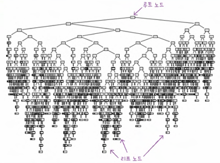
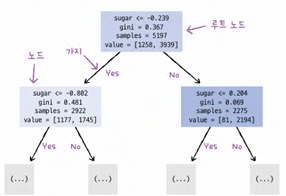
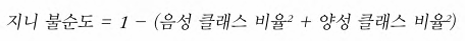
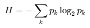

# Ch.5 트리 알고리즘
## 1. 결정 트리

```python
import matplotlib.pyplot as plt
from sklearn.tree import plot_tree
plt.figure(figsize=(10, 7))
plot_tree(dt)
plt.show()
```
- `plot_tree()` : 결정트리를 트리 그림으로 출력
너무 복잡!! ➡️ **하이퍼파라미터 수정**


```python
plot_tree(dt, max_depth=1, filled=True, feature_names=['행1', '행2', '행3'])
plt.show()
```
- `label='all'/'root'/'none'`(기본값은 all) : 표시할 텍스트 종류
  - 테스트 조건 ex. sugar <= -0.239
  - gini 지니불순도 
  - samples 총 샘플 수
  - value 클래스별 샘플 수 
- `filled=True` : 노드의 배경색 여부; 어떤 클래스의 비율이 높아지면 색이 진해짐

❓ **gini 지니 불순도**

- gini = 0.5 : 노드의 두 클래스 비율이 정확히 1/2씩 => 최악!
- gini = 0 : 노드에 하나의 클래스만 있는것(순수노드)
1. 이진분류인 경우
0(순수노드) <= gini(G) <= 0.5 (반반)
2. 다중클래스인 경우
0 <= gini(G) < 1 (0.5보다 커질 수 있음)

```text
결정트리가 노드를 나누는 방법
💡 부모와 자식 노드 사이의 불순도 차이(정보 이득)이 최대가 되도록
>> 불순도에 따라 나누기 때문에 ‼️표준화 전처리 불필요‼️
```

❓ **entropy 엔트로피**

```
gini vs entropy
> 속도와 이론적 해석의 차이가 있으나, 결정 트리에서 큰 차이 없음
> DecisionTreeClassifier의 default 는 gini
```

**feature_importances**
```python
print(dt.feature_importances_)
```
- 특성 중요도의 효과?를 잘 못 느꼈는데 확실히 결정트리에서는 클래스를 분류하는데 어떤 특성이 영향을 많이 미쳤는지 보고 해석할 수 있겠구나..~!

## 2. 교차 검증과 그리드 서치
```python
from sklearn.model_selection import GridSearchCV
params = {'min_impurity_decrease' : [0.0001, 0.0002, 0.0003, 0.0004, 0.0005]}
gs = GridSearchCV(DecisionTreeClassifier(random_state=42), params, n_jobs=-1)
gs.fit(train_input, train_target)
dt = gs.best_estimator_
```
- GridSearch 를 이용하면 하이퍼파라미터 & 모델 파라미터 최적값 찾기 한 번에 가능
- `min_impurity_decrease` : 노드를 분할하기 위한 불순도 감소 최소량 

➡️ 더 복잡하게 
```python
params = {'min_impurity_decrease': np.arange(0.0001, 0.001, 0.0001), 'max_depth': range(5, 20, 1), 'min_samples_split': range(2, 100, 10)}
```
- `range(숫자1, 숫자2, 숫자3)` : 숫자1에서 시작해서 숫자2가 될 때까지 숫자3씩 증가하면서 매개변수 조정 

➡️ 매개변수 값 범위나 간격 정하기 어려울 때 / 너무 많은 매개변수 조건이 있을 때

**랜덤 서치** : 매개변수를 샘플링할 수 있는 확률 분포 객체 전달
```python
from scipy.stats import uniform, randint 
params = {'min_impurity_decrease': uniform(0.0001, 0.001), 'max_depth': randint(20, 50), 'min_samples_split': randint(2, 25), 'min_samples_leaf': randint(1, 25),}

from sklearn.model_selection import RandomizedSearchCV
gs = RandomizedSearchCV(DecisionTreeClassifier(random_state=42), params, n_iter=100, n_jobs=-1, random_state=42)
gs.fit(train_input, train_target)
```

## 3. 트리의 앙상블
### 1) 랜덤 포레스트 Random Forest 
```python
from sklearn.model_selection import cross_validate
from sklearn.ensemble import RandomForestClassifier
rf = RandomForestClassifier(n_jobs=-1, random_state=42)
scores = cross_validate(rf, train_input, train_target, return_train_score=True, n_jobs=-1)
print(np.mean(scores['train_score']), np.mean(scores['test_score']))
```
#### 작동원리 
- 훈련 데이터를 부트스트랩 샘플링(중복해서 랜덤 추출) ;단, 훈련 샘플과 크기 같게 샘플링

-> RandomForestClassifier(전체 특성 개수의 제곱근만큼 특성 선택)/RandomForestRegressor(전체 특성 사용)

-> **분류** : 기본적으로 100개의 결정 트리를 이런 방식으로 훈련 후 각 트리의 클래스별 확률을 평균하여 가장 높은 확률을 가진 클래스를 예측으로 삼음 / **회귀** : 단순히 각 트리의 예측 평균

#### 장점
랜덤하게 선택한 샘플 & 특성 사용 => 훈련 세트 과대적합 방지 + 일반화 성능 높임 

#### OOB 샘플
```python
rf = RandomForestClassifier(oob_score=True, n_jobs=-1, random_state=42)
rf.fit(train_input, train_target)
print(rf.oob_score_)
```
- 부트스트랩 샘플에 포함되지 않은 남은 샘플(out of bag sample)
- 검증세트의 역할 수행 가능 => 별도의 검증세트를 분리할 필요가 없으므로 **훈련 세트에 더 많은 샘플 사용 가능**

### 2) 엑스트라 트리 Extra Trees 
#### 작동원리 
- 부트스트랩 샘플링을 사용하지 않고 전체 훈련 세트로 결정 트리 만듦
- 노드 분할시 가장 좋은 분할 찾기 x. **무작위 분할**(임계값 자체가 무작위)

```text
 과적합 방지하고 안정성을 높으리면 랜덤포레스트, 
 빠른 속도를 원하면 엑스트라 트리
 ```

 ### 3) 그레이디언트 부스팅 Gradient Boosting
 ```python
 from sklearn.ensemble import GradientBoostingClassifier
 gb = GradientBoostingClassifier(random_state=42)
 scores = cross_validate(gb, train_input, train_target, return_train_score=True, n_jobs=-1)
 print(np.mean(scores['train_socre']), np.mean(scores['test_score']))
 ```

 #### 작동원리
 - 깊이가 얕은 결정트리를 사용하여 이전 트리의 오차를 보완하는 방식 

#### 매개변수 subsample
- 트리 훈련에 사용할 훈련 세트의 비율 정함
  - `subsample=1` : 전체 훈련 세트 사용
  - `subsample<1` : 훈련 세트의 일부 사용 (확률적 경사 하강법 또는 미니배치 경사 하강법과 유사)

### 4) 히스토그램 기반 그레이디언트 부스팅 Histogram-based Gradient Boosting
#### 작동 원리
- 입력 특성을 256개의 구간으로 나눔 => 최적의 분할을 빠르게 찾을 수 있음 

#### `permutation_importance()`
- 특성 중요도 계산
  - 특성을 하나씩 랜덤하게 섞어서 모델 성능 변화 관찰 후 중요도 계산 (훈련, 테스트 세트 전부 사용 가능)

### XGBoost 라이브러리
- Scikit learn 라이브러리가 아니더라도 그레디언트 부스팅 알고리즘 구현 가능
  - `tree_method = hist` 로 할 경우 히스토그램 기반 그레디언트 부스팅 
- LightGBM 도 사용 가능(`LGBMClassifier`)

## cf
```python
df.describe()
```
- 시각화가 아니라 describe 를 활용해서 스케일 확인하고 scaler 사용 여부를 결정해도 됨

```python
data = df.[['행1', '행2', '행3', ...]].to_numpy()
target = df['타겟변수'].to_numpy()
```
- Scikit-learn 같은 ML 라이브러리들이 NumPy 배열을 입력받도록 설계되어 있기 때문에 numpy 배열로 변경 必
```python
random state = 00
```
- random state 숫자가 같을 경우 동일한 랜덤 데이터로 훈련
- 실전에서는 필요하지 않지만, 연습 또는 코드 공유 시에 같은 숫자로 하면 동일한 점수를 얻을 수 있음

`scipy(싸이파이) 라이브러리` : 적분, 보간, 선형대수, 확률 등을 포함한 수치 계산 전용 라이브러리(싸이킷런이 넘파이와 싸이파이 기능을 많이 사용함)

```python
from scipy.stats import uniform, randint
rgen = randint(0, 10)
np.unique(rgen.rvs(1000), return_counts=True)
```
- 정수 10개씩 묶여있는 배열 1000개를 뽑음
- `randint` 자리에 `uniform` 넣으면 실수 10개씩 묶여있느 배열 1000개 뽑음