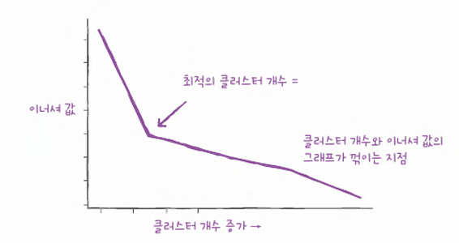

# 비지도 학습
## 1. 군집 알고리즘
```python
print(fruits[0, 0, :])
```
- 사진 100개 중 첫번째 사진, 첫번째 행에 있는 픽셀 100개 값 출력

```python
plt.imshow(fruits[0], cmap='gray')
plt.show()
```
- 0~255 픽셀값을 바탕으로 이미지 그려줌
  - 숫자가 낮을수록 검게, 높을수록 밝게 표시됨
> 근데 흑백사진의 물체는 보통 어둡게 표현되기 때문에, 이미지 색반전을 먼저해서 물체가 높은 숫자의 픽셀로 표현되도록 조정하는게 좋음!

```python
fig, axs = plt.subplots(1, 2)
axs[0].imshow(fruits[100], cmap='gray_r')
axs[1].imshow(fruits[200], cmap='gray_r')
plt.show()
```
- `subplots` 함수를 사용햐여 여러 개의 그래프를 배열처럼 쌓을 수 있음.
  - `subplots(1, 2)` 를 통해 `axs[0]`에 파인애플 이미지, `axs[1]`에 바나나 이미지 생성; (1, 2) 는 1개의 행과 2개의 열을 의미

```python
 apple = fruits[0:100].reshape(-1, 100*100)
 pineapple = fruits[100:200].reshape(-1, 100*100)
```
- `reshape()`를 사용해 두번째 차원(100)과 세번째 차원(100)을 10000으로 합치고, 첫번째 차원을 -1로 지정하여 자동으로 남은 차원을 할당
- `print(apple.shape)` 을 하면 배열 크기 (100, 100000) 나옴
- 차원을 낮춰서 평균 계산 후에 히스토그램, 막대그래프로 시각화해서 과일별 구분할 수 있음

```python
apple_mean = np.mean(apple, axis=0).reshape(100, 100)
fig, axs = plt.subplots(1, 3, figsize=(20, 5))
axs[0].imshow(apple_mean, cmap='gray_r')
plt.show()
```
- 또는 픽셀 평균값 100*100 크기로 바꿔서 이미지처럼 출력가능
  - 픽셀 평균값으로 표현된 이미지를 대표 이미지로 생각할 수 있음

```python
abs_diff = np.abs(fruits - apple_mean)
abs_mean = np.mean(abs_diff, axis=(1, 2))
print(abs_mean.shape)
```
- 위에서 과일별로 픽셀 평균값을 구했으니, 모든 과일의 픽셀값을 사과 픽셀 평균값으로 뺀 후 절댓값으로 반환

```python
apple_index = np.argsort(abs_mean)[:100]
fig, axs = plt.subplots(10, 10, figsize=(10, 10))
for i in range(10):
    for j in range(10):
        axs[i, j].imshow(fruits[apple_index[i*10 + j]], cmap='gray_r')
        axs[i, j].axis('off')
plt.show()
```
- `np.argsort()` 함수를 이용해 절댓값오차가 작은것에서 큰 순서대로 나열한 것의 인덱스를 반환 
- `axis('on')으로 할 경우 좌표축을 그릴 수 있음

## 2. k-평균
```text
⚠️1장에서의 문제점?
- 비지도 학습은 어떤 과일이 있는지도 모르고, 그 과일의 대푯값을 위와 같이 계산할 수 없음

💡k-means 군집 알고리즘을 통해 평균값을 찾기
```

### k-means 동작 원리
1. 무작위로 k개의 클러스터 중심을 정함
2. 각 샘플에서 가장 가까운 클러스터 중심을 찾아 해당 클러스터의 샘플로 지정
3. 클러스터에 속한 샘플의 평균값으로 클러스터 중심을 변경
4. 클러스터 중심에 변화가 없을 때까지 2번으로 돌아가 반복

```python
from sklearn.cluster import KMeans
km = KMeans(n_cluster=3, random_state=42)
km.fit(fruits_2d)
```
- `init = 'k-means++'` 기본값 : 첫번째 중심은 무작위로 뽑고 나머지 중심들은 현재 뽑힌 중심들과의 거리에 비례하는 확률로 순차 선택
  - 자연스럽게 서로 멀리 떨어진 지점들이 선택되어 군집화가 빠르고 안정적으로 수렴
- `init = 'random'` : 단순이 데이터 샘플 중 k 개를 균등한 확률로 뽑아 중심으로 사용 
  - 클러스터 크기에 대한 제약이 없기 때문에 효율이 좋지 않음

```python
import matplotlib.pyplot as plt
def draw_fruits(arr, ratio=1):
    n=len(arr)
    rows=int(np.ceil(n/10))
    cols=n if rows<2 else 10
    fig, axs = plt.subplots(rows, cols, figsize=(cols*ratio, rows*ratio, squeeze=False))
    for i in range(rows):
        for j in range(cols):
            if i*10 + j<n:
                axs[i, j].imshow(arr[i*10 + j], cmap='gray_r')
            axs[i, j].axis('off')
    plot.show
```
- `draw fruits` 라는 함수를 정의함으로써 (샘플 개수, 너비, 높이)의 3차원 배열을 입력받아 가로로 10개씩 이미지 출력
- 실제 사용 `draw_fruits(fruits[km.labels_==0])`

```python
draw_fruits(km.cluster_centers_.reshape(-1, 100, 100), ratio=3)
```
- KMeans 클래스가 찾은 센트로이드는 `cluster_centers_`에 저장

```python
print(km.n_iter)
```
- `km.n_iter` : k-means 알고리즘이 반복적으로 클러스터 옮긴 횟수 반환

### 최적의 k 찾기
⚠️ k-means 클러스터의 단점은 사전에 n_clusters 수를 지정해줘야함

=> 즉, 최적의 k 를 찾아야 좋은 군집화가 될 수 있음

#### 엘보우
- 동작 원리 : 클러스터 개수에 따른 이너셔의 변화를 관찰하여 최적의 클러스터 개수를 찾는것
  - **이너셔** : 클러스터 샘플이 얼마나 가깝게 있는지 거리의 제곱합으로 계산한 값


- 클러스터 개수를 증가시킴에 따라 나타나는 이너셔를 그래프로 표현해보면 위와 같은 엘보우 포인트가 존재 > **최적의 k는 엘보우 포인트에서의 k**

```python
inertia = []
for k in range(2, 7):
    km = KMeans(n_clusters=k, random_state=42)
    km.fit(fruits_2d)
    inertia.append(km.intertia_)
plt.plot(range(2, 7), inertia_)
plt.xlabel('k')
plt.ylabel('inertia')
plt.show()
```

## 3. 주성분 분석
### 차원과 차원축소
- 다차원 배열에서의 차원 : 배열의 축 개수
- 1차원 배열에서의 차원 : 10000개의 특성 = 100000개의 차원(원소의 개수)

### PCA 주성분 분석
- 개념 : 데이터에 있는 분산이 큰 방향을 찾는 것 => 분산이 큰 방향을 데이터로 잘 표현하는 벡터(주성분)로 생각할 수 있음


## cf. 
- 코랩 코드 셀에서 `!` 문자로 시작하면?
  - 리눅스 셀 명령으로 이해 

```python
plt.imshow(fruits[0], cmap='gray_r')
plt.show()
```
- _r 을 붙이면 다시 색반전

```python
plt.legend(['apple', 'pineapple', 'banana'])
plot.show()
```
- `legend 를 이용해 과일별 구분
- `abs()` 절댓값 계산하는 함수
  - `abs(-1)` => 1