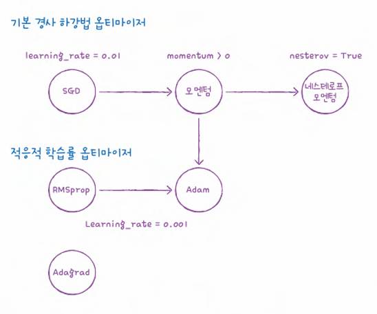

# 딥러닝 시작
## 1. 인공신경망
### SGDClassifier 를 통한 분류
```python
train_scaled = train_input / 255.0
train_scaled = train_scaled.reshape(-1, 28*28)
```
- `SGDClassifier` 는 2차원 입력을 다루지 못하기 때문에 각 샘플을 1차원 배열로 만듦

```python
from sklearn.model_selection import cross_validate
from sklearn.linear_model import SGDClassifier
sc = SGDClassifier(loss='log', max_iter=5, random_state=42)
scores = cross_validate(sc, train_scaled, train_target, n_jobs=-1)
print(np.mean(scores['test_score']))
```
- `SGDClassifier` 가 경사하강법을 통해 각 클래스별 가중치 벡터와 절편 찾아냄

### 인공신경망


#### tensorflow 와 keras
- `tensorflow` : 구글이 2015.11 오픈소스로 공개한 딥러닝 라이브러리
  - `import tensorflow as tf`
- `keras` : 텐서플로의 고수준 API
  - GPU 연산을 수행하는 tensorflow, 씨아노, CNTK 와 같은 여러 딥러닝 라이브러리를 백엔드로 사용 (**멀티-백엔드 케라스**)
  - `from tensorflow import keras`

```python
dense = keras.layers.Dense(10, activation = 'softmax', input_shape=(784,)) # 뉴런개수, 뉴런 활성화 함수, 입력크기 
model = keras.Sequential(dense)
```
- 클래스가 10개이므로 뉴런 개수 10개로 지정
- softmax : 뉴런에서 출력되는 값을 확률로 비꾸기 위해 사용
  - 이진분류라면 -> `activation='sigmoid'`

```python
model.compile(loss='sparse_categorical_crossentropy', metrics='accuracy')
```
- 이진분류 : binary_crossentropy
- 다중분류 : categorical_crossentropy

#### crossentropy

- `-log` 정답 클래스 확률만 계산하여 손실을 최소화하도록 학습
```text
손실함수는
- 모델의 성능을 수치화하고
- 그 값의 기울기를 통해 파라미터를 갱신하며
- 학습 진행상황을 모니터링 -> 어떻게, 얼마나 가중치를 바꿔야하는지 가이드
```

#### sparse_crossentropy
- 원-핫 인코딩을 하지 않고 정수로된 타깃값을 사용해 크로스 엔트로피 손실 계산

## 2. 심층신경망

```python
# 층 추가방법 1
dense1 = keras.layers.Dense(100, activation='sigmoid', input_shape=(784, ))
dense2 = keras.layers.Dense(10, activation='softmax')
model = keras.Sequential([dense1, dense2]) #출력층을 마지막에
```
- 은닉층의 뉴런 개수 : 특별한 기준은 없음. 출력층의 뉴런보다 많게하면 됨

```python
mode.summary()
```

- 모델 이름, 층 이름, 클래스, 출력 크기, 모델 파라미터 개수 출력
- `(None, 100)` ❓None?
  - keras 모델의 fit() method는 훈련 데이터를 한 번에 사용하지 않고 나누어 여러번에 걸쳐 사용하는 **미니배치 경사하강법**
  - 기본 미니배치의 크기는 32개. `batch_size` 매개변수로 변경 가능
  - **샘플 개수를 고정하지 않고 어떤 배치 크기에도 유연하게 대응할 수 있도록 none 으로 설정**

```python
# 층 추가방법2
model=keras.Sequential([
    keras.layers.Dense(100, activation='sigmoid', input_shape=(784, ), name='hidden'),
    keras.layers.Dense(10, activation='softmax', name='output')
], name='모델이름')
```
- 모델 이름은 상관없지만, 층의 이름은 반드시 영문이어야함
- 단점 : 한 눈에 볼 수 있지만, 층이 많아지면 코드도 길어지고, 조건에 따라 층을 추가할 수 없음

```python
# add() 를 이용한 층 추가
model = keras.Sequential()
model.add(keras.layers.Dense(100, activation='sigmoid', input_shape=(784, )))
model.add(keras.layers.Dense(10, activation='softmax'))
```

#### 모델 훈련
```python
model.compile(loss='sparse_categorical_crossentropy', metrics='accuracy')
model.fit(train_scaled, train_target, epochs=5)
```

### ReLU 함수

- 입력이 양수일 경우 입력 통과, 음수일 경우 0
- 특수 이미지 처리에서 좋은 성능

```python
model = keras.Sequential()
model.add(keras.layers.Flatten(input_shape=(28, 28)))
model.add(keras.layers.Dense(100, activation='relu'))
model.add(keras.layers.Dense(10, activation='softmax'))
```
- `Flatten` : 배치 차원을 제외하고 나머지 입력 차원을 모두 일렬로 펼치는 역할 -> 성능에 기여하는 바는 없지만, 입력층과 은닉층 사이에 추가하기 때문에 model.add 를 이용해서 추가


- model summary 에서 flatten output shape 를 (None, 784) 로 확인 가능하고, 이를 통해 입력값의 차원을 짐작할 수 있음

### optimizer

- 기본 경사하강법 옵티마이저 : **SGD 클래스**에서 제공
  - if momentum > 0 : 이전의 gradient 를 가속도처럼 사용하는 **모멘텀 최적화** 사용
  - `nesterov=True` : 모멘텀 최적화를 2번 반복하여 구현
- **적응적 학습률 옵티마이저**
  - Adagrad, RMSprop, Adam(모멘텀최적화 + RMSprop)

## 3. 신경망 모델 훈련
### 손실곡선
```python
model.compile(loss='sparse_categorical_crossentropy', metrics='accuracy')
history = model.fit(train_scaled, train_target, epochs=5, verbose=0) #verbose 는 훈련 과정 출력 조절
```
- keras 는 기본적으로 에포크마다 손실 계산하고, metrics='accuracy'를 추가했으므로 accuracy 도 history 속성에 포함

```python
import matplotlib.pyplot as plt
plt.plot(history.history['loss'])
plt.xlabel('epoch')
plt.ylabel('loss')
plt.show()
```
**손실함수**


**accuracy 시각화**


**검증 손실**
```python
model=model_fn()
model.compile(loss='sparse_categorical_crossentropy', metrics='accuracy')
history=model.fit(train_scaled, train_target, epochs=20, verbose=0, validation_data=(val_scaled, val_target))
```


- 에포크 5 이후로 검증손실 상승 & 훈련손실 감소 -> 과대적합
- 검증손실이 상승하는 시점을 뒤로 늦추면 검증 세트에 대한 손실이 줄어들고, 검증 세트에 대한 정확도도 증가할 것

### 드롭아웃


- 훈련과정에서 층에 있는 일부 뉴런을 랜덤하게 꺼서(출력을 0으로 만들어서) 과대적합 방지
  - 일부 뉴런의 출력이 없을 수 있다는 것을 감안하여 더 안정적인 예측할 수 있음
```python
model = model_fn(keras.layers.Dropout(0.3))
model.summary()
```


- 일부 뉴런의 출력을 0으로 만들지만 전체 출력 배열의 크기를 바꾸지는 않음
- 훈련 시에는 dropout 을 이용하여 과대적합 방지하지만 **예측 시에는 적용하면 안됨**

**dropout 후 validation loss**


- 에폭이 커져도 이전과 달리 손실이 상승하지 않음

### 모델 저장과 복원, 콜백
```python
model.save_weights('mode-weights.h5')
model.save('model-whole.h5')
```
- 모델의 파라미터 및 구조 저장 가능

```python
checkpoint_cb = keras.callbacks.ModelCheckpoint('best-model.h5')
model.fit(train_scaled, train_target, epochs=20, verbose=0, validation_data=(val_scaled, val_target), callbacks=[checkpoint_cb])
```
- 훈련 과정 중간에 어떤 일이 발생했을 때 자동으로 실행되는 함수
- 학습률 조정, 조기 종료, 모델 저장, 로그 기록 등
  - 조기 종료 `EarlyStopping` : `patience`매개변수를 지정 후, 해당 횧수만큼 검증 점수가 향상되지 않으면 훈련 중지
  - restore_best_weights : 가장 낮은 검증 손실을 낸 모델 파라미터로 되돌림


## cf
